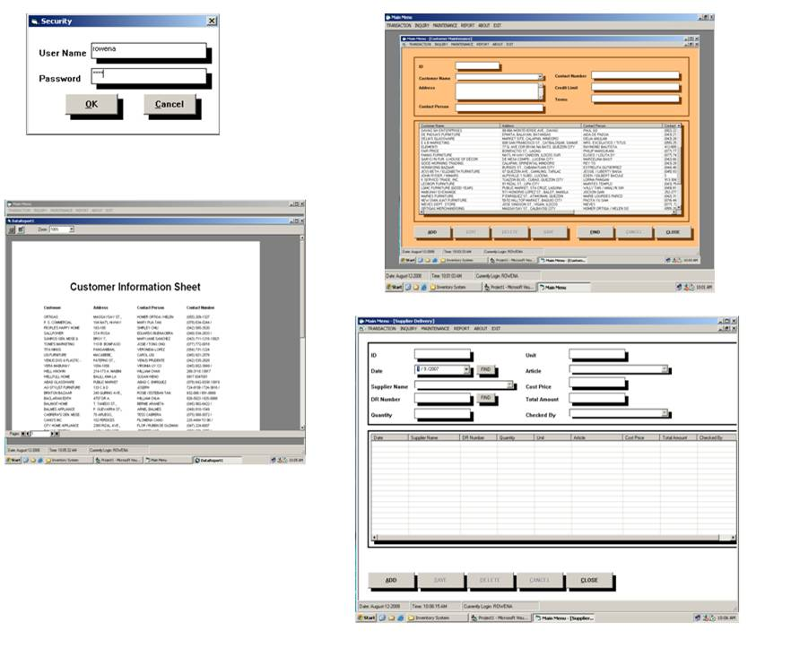



## Complete Inventory System

### Description

It allows the end users to encode the necessary transactions for the products delivered by the supplier and the products delivered to the customer. it has necessary maintenance for the customer, products, suppliers and users for record keeping (with add, edit, delete, save, find and cancel button).Counts the remaining item and prompt messages when in reaches the critical level of specific product. It has report sample as well using data report.The username is rowena and the password is weng. you can also check the it in my security table in ms access. hope you like it! DONT FORGET TO VOTE FOR ME TNX!
 
### More Info
 
Check the username and password in my database.

Username: Rowena Password: weng

I used ms access as my sample database design for immediate presentation to the client.

you may email me at professor_rowena@yahoo.com to get the sql server database version

             |
---                |---
**Submitted On**   |2008-08-12 11:08:24
**By**             |[Rowena E\. Villareal](https://github.com/Planet-Source-Code/PSCIndex/blob/master/ByAuthor/rowena-e-villareal.md)
**Level**          |Advanced
**User Rating**    |4.7 (164 globes from 35 users)
**Compatibility**  |VB 6\.0
**Category**       |[Databases/ Data Access/ DAO/ ADO](https://github.com/Planet-Source-Code/PSCIndex/blob/master/ByCategory/databases-data-access-dao-ado__1-6.md)
**World**          |[Visual Basic](https://github.com/Planet-Source-Code/PSCIndex/blob/master/ByWorld/visual-basic.md)
**Archive File**   |[Complete\_I2123308112008\.zip](https://github.com/Planet-Source-Code/rowena-e-villareal-complete-inventory-system__1-70950/archive/master.zip)

